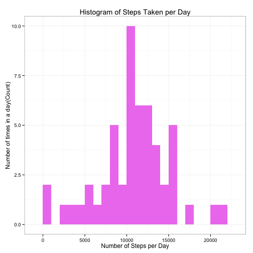
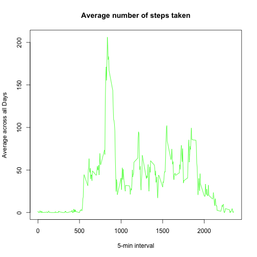
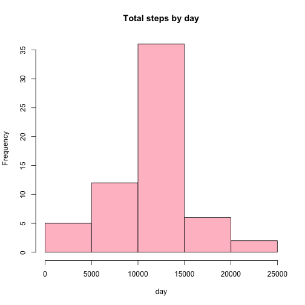
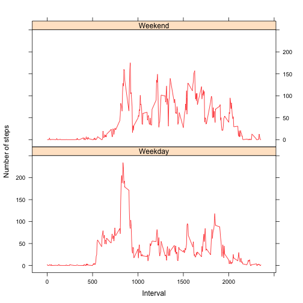

#Peer Assesment 1
##Prepare the R environment

Throughout this report when writing code chunks in the R markdown document, always use echo = TRUE so that someone else will be able to read the code.
First, we set echo equal a TRUE and results equal a 'hold' as global options for this document.


```r
library(knitr)
opts_chunk$set(echo = TRUE, results = 'hold')
```

###Load Required Libraries

```r
library(data.table)
```

```
## data.table 1.9.2  For help type: help("data.table")
```

```r
library(ggplot2)
library(lattice)
```

##Loading and preprocessing the data

```r
rdata <- read.csv('activity.csv', header = TRUE, sep = ",",
                  colClasses=c("numeric", "character", "numeric"))
```

Verify the data using "str()"


```r
str(data)
```

```
## function (..., list = character(), package = NULL, lib.loc = NULL, 
##     verbose = getOption("verbose"), envir = .GlobalEnv)
```

##What is mean total number of steps taken per day?

Ignoring missing values, we proceed by calculating the total steps per day.


```r
steps_per_day <- aggregate(steps ~ date, rdata, sum)
colnames(steps_per_day) <- c("date","steps")
head(steps_per_day)
```

```
##         date steps
## 1 2012-10-02   126
## 2 2012-10-03 11352
## 3 2012-10-04 12116
## 4 2012-10-05 13294
## 5 2012-10-06 15420
## 6 2012-10-07 11015
```

Here is a histogram of the total number of steps taken per day.


```r
ggplot(steps_per_day, aes(x = steps)) + 
       geom_histogram(fill = "violet", binwidth = 1000) + 
        labs(title="Histogram of Steps Taken per Day", 
             x = "Number of Steps per Day", y = "Number of times in a day(Count)") + theme_bw()
```

 

Now we calculate the mean and median of the number of steps taken per day.


```r
steps_mean   <- mean(steps_per_day$steps, na.rm=TRUE)
steps_median <- median(steps_per_day$steps, na.rm=TRUE)
```

The mean is 1.0766 &times; 10<sup>4</sup> and median is 1.0765 &times; 10<sup>4</sup>.


```r
steps_mean
steps_median
```

```
## [1] 10766
```

```
## [1] 10765
```

##What is the average daily activity pattern?

We took 5 minutes intervals as integers.


```r
time_series <- tapply(rdata$steps, rdata$interval, mean, na.rm = TRUE)
```

Corresponding Plot:

```r
plot(row.names(time_series), time_series, type = "l", xlab = "5-min interval", 
    ylab = "Average across all Days", main = "Average number of steps taken", 
    col = "green")
```

 

Which 5-minute interval, on average across all the days in the dataset, contains the maximum number of steps?


```r
max_interval <- which.max(time_series)
```

The 835th interval has maximum steps.

##Imputing missing values:

Calculate and report the total number of missing values in the dataset (i.e. the total number of rows with NAs)


```r
rdata_NA <- sum(is.na(rdata))
rdata_NA
```

```
## [1] 2304
```

Devise a strategy for filling in all of the missing values in the dataset. The strategy does not need to be sophisticated. For example, you could use the mean/median for that day, or the mean for that 5-minute interval,etc

First Na replaced by mean in 5 min interval


```r
StepsAverage <- aggregate(steps ~ interval, data = rdata, FUN = mean)
fillNA <- numeric()
for (i in 1:nrow(rdata)) {
    obs <- rdata[i, ]
    if (is.na(obs$steps)) {
        steps <- subset(StepsAverage, interval == obs$interval)$steps
    } else {
        steps <- obs$steps
    }
    fillNA <- c(fillNA, steps)
}
```

Create a new dataset that is equal to the original dataset but with the missing data filled in.


```r
new_rdata <- rdata
new_rdata$steps <- fillNA
```

Make a histogram of the total number of steps taken each day and Calculate and report the mean and median total number of steps taken per day. Do these values differ from the estimates from the first part of the assignment? What is the impact of imputing missing data on the estimates of the total daily number of steps?


```r
StepsTotal2 <- aggregate(steps ~ date, data = new_rdata, sum, na.rm = TRUE)
```

The Histogram is


```r
hist(StepsTotal2$steps, main = "Total steps by day", xlab = "day", col = "pink")
```

 


```r
mean_val <- mean(StepsTotal2$steps)
median_val <- median(StepsTotal2$steps)
mean_val
median_val
```

```
## [1] 10766
```

```
## [1] 10766
```

Mean is 1.0766 &times; 10<sup>4</sup> and median is 1.0766 &times; 10<sup>4</sup>

After replacing the mean is the same but the median is a little bit different

##Are there differences in activity patterns between weekdays and weekends?

For this part the weekdays() function may be of some help here. Use the dataset with the filled-in missing values for this part.

Create a new factor variable in the dataset with two levels – “weekday” and “weekend” indicating whether a given date is a weekday or weekend day.


```r
day <- (weekdays(as.Date(rdata$date,"%Y-%m-%d")))
daylevel <- vector()
for (i in 1:nrow(rdata)) {
    if (day[i] == "Saturday") {
        daylevel[i] <- "Weekend"
    } else if (day[i] == "Sunday") {
        daylevel[i] <- "Weekend"
    } else {
        daylevel[i] <- "Weekday"
    }
}
rdata$daylevel <- daylevel
rdata$daylevel <- factor(rdata$daylevel)

stepsByDay <- aggregate(steps ~ interval + daylevel, data = rdata, mean)
names(stepsByDay) <- c("interval", "daylevel", "steps")
```

Make a panel plot containing a time series plot (i.e. type = “l”) of the 5-minute interval (x-axis) and the average number of steps taken, averaged across all weekday days or weekend days (y-axis). The plot should look something like the following, which was creating using simulated data:


```r
xyplot(steps ~ interval | daylevel, stepsByDay, type = "l", layout = c(1, 2), 
    xlab = "Interval", ylab = "Number of steps", col.line = "red")
```

 

We can see at the graph above that activity on the weekday has the greatest peak from all steps intervals. But, we can see too that weekends activities has more peaks over a hundred than weekday. This could be due to the fact that activities on weekdays mostly follow a work related routine, where we find some more intensity activity in little a free time that the employ can made some sport. In the other hand, at weekend we can see better distribution of effort along the time.
